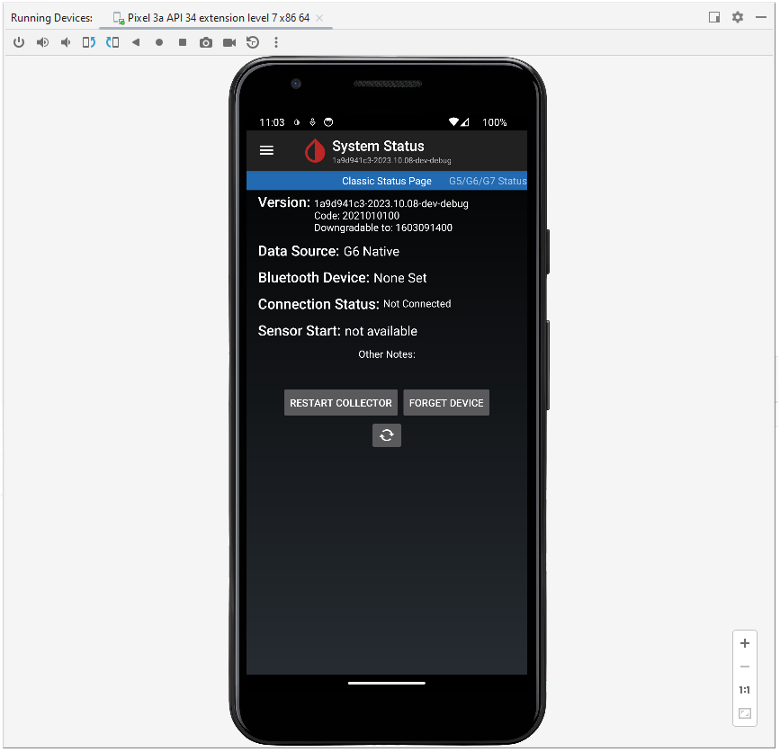

[back to index](Index.md)
# How to build xDrip+ from sources

*Building xDrip+ from sources is difficult and time-consuming. You may want to install an already build version instead.*

These are my personal notes, i'm not an expert on Android stuff.

## 1. Create a github account

Most likely, you want to build not just once, but more often.
To have a fork that can just be updated from the xDrip+ repo, you need an github account.

## 2. Fork xDrip+ into your github

Fork [NightscoutFoundation/xDrip](https://github.com/NightscoutFoundation/xDrip) on github.

## 3. Install Android Studio

Get [Android Studio](https://developer.android.com/studio) and install it.

## 4. Create a new github token

**Important: be shure to copy the token in this process, you will be never able to see it again.**

**Deleting & recreating will the only solution, once you lost the copied string.**

Log in to your github and
  - Click on your avatar in the top right hand corner
  - Choose *Settings -> Developer settings -> Personal access tokens -> Tokens (classic)*
  - Click on *Generate new token -> Generate new token (classic)*
  - Add a note/description you may remember for shure later, like "Android Studio" *(recommended)*
  - select Expiration -> No Expiration
  - Select repo(all), workflow, read:org (under admin:org), gist
  - Click on *Generate token*
  - Copy the token to clipboard or editor. Be shure not to loose it.

## 5. Paste the token into Android Studio

On Android Studio
  - create an empty project
  - Go to File -> Settings -> Version Control -> GitHub -> Add an account
  - Click on the "Login with Token" hyperlink
  - Paste your token, click login, click ok
  - close project

## 6. Get the sources into Android Studio

- create an empty project
- In the startup menu, click `Get from VCS`.
- You should now see a list of your GitHub projects, including the newly forked `xDrip`. Select it and click `Clone`.

## 7. Building xDrip+ in Android Studio

Probably, you will encounter an `Unsupported Java` error. To be able to build xDrip, an old JDK version 11 and old version of Gradle 6.x is required:
  - Open the following menu: *File -> Settings -> Build, Execution, Deployment -> Build Tools -> Gradle*.
  - In the `Gradle JDK` dropdown, select `Download JDK...`.
  - For `Version:`, select `11`; leave the remaining options unchanged.
  - Click `Download`, then click `Apply` and `OK`.
  - Close the settings window.
  - Restart Android Studio.

You should now be able to build xDrip.
You may also try to run it in Android Studio before installing it.

## 8. Creating xDrip+ APK in Android Studio

To be installable in Android (deploying to hardware), we need to create a signed APK package.

Go to *Build -> Build Bundle(s) / APK(s) -> Build APK(s)*

Selecting any other than *Debug builds* seems to require some signatures, which i don't have and building an APK fails.

**If you know more than i, how to solve, pls let me know!**

So, you need to choose debug builds.

[back to index](Index.md)
