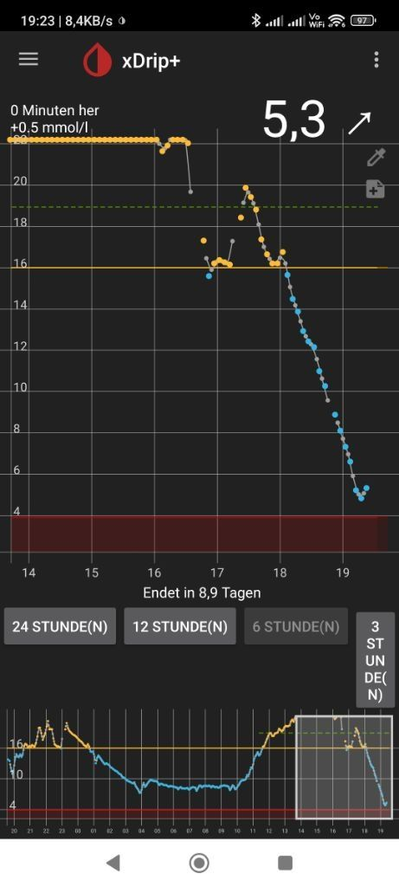

# About
This repo contains no source code, but hints how to use a **Dexcom G7** with **xdrip+**.

**If you don't already know what a Dexcom G7 actually is, you may safely ignore this repo,
as in such case it doesn't contain useful informations for you.**

But if you are using one and not happy with vendors software package, this may be worth reading.

# From the xDrip Readme:

*xDrip+ is an unofficial and independent Android app which works as data hub and processor between many different devices.*

*It supports wireless connections to G4, G5, G6, Medtrum A6, Libre via NFC and Bluetooth, 630G, 640G, 670G pumps and Eversense CGM via companion apps. Bluetooth Glucose Meters such as the Contour Next One, AccuChek Guide, Verio Flex & Diamond Mini as well as devices like the Pendiq 2.0 Insulin Pen.*

*Heart-rate and step counter data is processed from Android Wear, Garmin, Fitbit and Pebble smart-watches and watch-faces for those that show glucose values and graphs.*

*On some Android Wear watches, it is possible for the G5 or G6 to talk directly to the watch so it can display values even when out of range of the phone.*

*The app contains sophisticated charting, customization and data entry features as well as a predictive simulation model.*

*Instant two-way synchronization is possible by linking follower handsets, data can also be uploaded and downloaded to a Nightscout web service or uploaded directly to Tidepool, MongoDB or InfluxDB.*

*Customization allows for different options to configure alarms, vocalize readings, change the display preferences etc. International users can update translations from within the app too.*

*Your data is yours and can be exported in many different ways. xDrip also intercommunicates with other apps, for example sending and receiving live data with AndroidAPS.*

# How does xDrip+ look like

Here's an example, how this software typically looks like.

# Why here?

As the informations are spread over several webpages and forums, i collect those infos, i need to know.
About any of the informations here can be found on the net, this is just a (for me) useful collection.
If you find any infos worth to add, pls use the issues section with a link.
